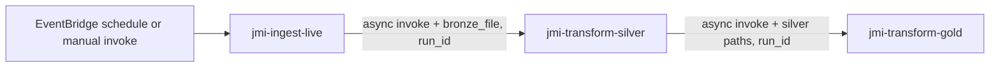

# JMI Lambda packaging and deployment

## What actually runs in AWS (current account/region)

The three functions **`jmi-ingest-live`**, **`jmi-transform-silver`**, and **`jmi-transform-gold`** are deployed as **container images** (`PackageType: Image`) from **Amazon ECR**, not from a `.zip` on S3.

- **Active artifact:** ECR image URI on each function (e.g. `…/jmi-lambda:<tag>`).
- **Optional zip archive:** `s3://<data-bucket>/lambda_legacy/jmi-lambda.zip` (audit/download only). **`lambda/`** under the bucket should stay empty; live Lambdas use **ECR images**, not this zip.

## Canonical deploy (ECR → Lambda)

From the **repository root**, with Docker **daemon** running and AWS CLI configured for the target account:

```bash
chmod +x infra/aws/lambda/deploy_ecr_create_update.sh
./infra/aws/lambda/deploy_ecr_create_update.sh v20-your-tag
```

This builds `infra/aws/lambda/Dockerfile` (includes full `src/` — Arbeitnow, Adzuna, shared pipelines) and `handlers/`, pushes to ECR, then updates all three functions to the new image.

### If local Docker is not available (recommended cloud paths)

- **GitHub Actions:** workflow `JMI Lambda ECR deploy` (`.github/workflows/jmi-lambda-ecr-deploy.yml`) — run **Workflow dispatch** from the Actions tab; requires repo secrets `AWS_ACCESS_KEY_ID` and `AWS_SECRET_ACCESS_KEY`. The runner provides Docker; no local daemon needed.
- **AWS CodeBuild:** use `infra/aws/lambda/codebuild/buildspec.yml` with a **privileged** project (`aws/codebuild/standard:7.0` or similar) so `docker build` runs in AWS. **AWS CloudShell does not support Docker** — do not use CloudShell for image builds.

Updating Lambdas after a push (same image URI on all three functions) can also be done **without Docker** via `infra/aws/lambda/update_lambdas_from_image_uri.sh` if you already have an image in ECR.

Environment variables for the functions are re-applied by the script (same as the historical zip flow).

## Optional: zip package (local / legacy)

`package_and_zip.sh` builds **`infra/aws/lambda/dist/jmi-lambda.zip`** using Docker (Linux deps) and copies `src/` + `handlers/`. It does **not** deploy to Lambda if your functions are image-based.

`deploy_create_update.sh` uses **`aws lambda update-function-code --zip-file`**, which **only applies to Zip-based functions**. It **exits with an error** if the target functions are `PackageType: Image` (see guard at top of that script).

## Optional: refresh the S3 zip (audit / human download only)

Does **not** change Lambda code unless you separately switch functions to S3-based zip deployment (not the current design).

```bash
./infra/aws/lambda/package_and_zip.sh
aws s3 cp infra/aws/lambda/dist/jmi-lambda.zip s3://jmi-dakshyadav-job-market-intelligence/lambda_legacy/jmi-lambda.zip --region ap-south-1
```

Or use `sync_lambda_zip_to_s3.sh` after `package_and_zip.sh`.

## Adzuna code in the image

The Dockerfile **`COPY src ./src`**. Anything under `src/jmi/` (including Adzuna connector and `ingest_adzuna` pipeline) is in the image. Scheduled **`jmi-ingest-live`** still invokes **`ingest_live`** (Arbeitnow) only; Adzuna is a separate manual/module entrypoint unless you add another function or change the handler.

---

## Lambda functions (code-level reference)

This section describes what each deployed function does in code: entrypoints, call chain, pipeline modules, and how they map to the repository layout.

### Summary

| AWS function name | Handler module | Core pipeline |
|-------------------|----------------|---------------|
| `jmi-ingest-live` | `handlers.ingest_handler.handler` | `src.jmi.pipelines.ingest_live.run` |
| `jmi-transform-silver` | `handlers.silver_handler.handler` | `src.jmi.pipelines.transform_silver.run` |
| `jmi-transform-gold` | `handlers.gold_handler.handler` | `src.jmi.pipelines.transform_gold.run` |

All three use the **same ECR image**; Lambda **ImageConfig Command** selects which handler runs (see `deploy_ecr_create_update.sh`).

**Data plane:** `JMI_DATA_ROOT` is set to your S3 bucket root (for example `s3://<bucket>`). Paths and I/O go through `src/jmi/config.py` (`AppConfig`, `DataPath`) and helpers under `src/jmi/paths.py`, `src/jmi/utils/io.py`.

**Orchestration:** Ingest → Silver → Gold is chained with **`lambda:InvokeFunction`** and **`InvocationType: Event`** (asynchronous). Each step returns HTTP-style `{statusCode, body}` to the invoker; the async child runs independently.



---

### 1. `jmi-ingest-live` — Bronze ingest (Arbeitnow)

**Handler file:** `infra/aws/lambda/handlers/ingest_handler.py`

1. Calls **`ingest_run()`** — re-export of `src.jmi.pipelines.ingest_live.run()`.
2. If the pipeline result has **`invoke_silver: false`** (happens when **zero** bronze records were written), the handler **does not** invoke Silver and returns `200` with the JSON result. Otherwise:
3. Reads **`JMI_SILVER_FUNCTION_NAME`** (deploy script sets this to `jmi-transform-silver`).
4. Builds payload: **`bronze_file`** = `result["bronze_data_file"]`, **`run_id`** = `result["run_id"]`.
5. **`boto3` `lambda_client.invoke`**, async, to the Silver function.
6. Returns **`200`** and the ingest result (run id, paths, counts, etc.).

**What `ingest_live.run()` does** (`src/jmi/pipelines/ingest_live.py`):

- Creates a new **`run_id`**, sets **`bronze_ingest_date`** (UTC date) and **`batch_created_at`**.
- Loads **incremental connector state** and chooses **`incremental_strategy`** (`src/jmi/pipelines/bronze_incremental.py`).
- **Fetches jobs** from the Arbeitnow API via `src/jmi/connectors/arbeitnow.py` (`fetch_all_jobs`, `to_bronze_record`).
- **Filters** rows for Bronze with `select_jobs_for_bronze`.
- Writes **compressed JSONL** to a partitioned path from `bronze_raw_gz()` (`src/jmi/paths.py`) under `source=arbeitnow/...`.
- Writes **`manifest.json`** beside the file and a **health** JSON under the configured health root.
- **Persists connector state** (watermark for the next run).
- Returns a dict including **`bronze_data_file`**, **`run_id`**, and **`invoke_silver: len(bronze_records) > 0`**.

**Important:** This scheduled path is **Arbeitnow-only**. Adzuna ingest logic lives elsewhere in `src/`; using it in Lambda would require a different handler or parameters (see comments in this README above).

---

### 2. `jmi-transform-silver` — Bronze → Silver Parquet

**Handler file:** `infra/aws/lambda/handlers/silver_handler.py`

1. Reads **`bronze_file`** from the event (required in S3 mode; the ingest step passes the string URI).
2. Calls **`silver_run(bronze_file=bronze_file)`** — `src.jmi.pipelines.transform_silver.run`.
3. Reads **`JMI_GOLD_FUNCTION_NAME`** (`jmi-transform-gold`).
4. **`run_id`** = event `run_id` or `result["bronze_run_id"]` (lineage from Bronze).
5. Payload: **`silver_file`** = batch Parquet output, **`merged_silver_file`** = merged “latest” Parquet, **`run_id`**.
6. **Async invoke** Gold; returns **`200`** and the Silver quality/lineage dict.

**What `transform_silver.run()` does** (`src/jmi/pipelines/transform_silver.py`):

- **Lineage:** Parses **`ingest_date`** and **`run_id`** from the bronze key path (`_extract_lineage_from_bronze_path`).
- **Reads** the Bronze **`.jsonl.gz`** with `read_jsonl_gz`.
- **Source-aware normalization:** For each row, flattens `raw_payload`, derives skills (`src/jmi/connectors/skill_extract.py`), titles, locations, remote type, etc.; supports **Arbeitnow** and **Adzuna** shapes when that source appears in Bronze.
- **Dedupes** within the batch by `job_id`, runs **`run_silver_checks`** (`src/jmi/utils/quality.py`); fails the Lambda if checks do not pass.
- **Merges** with historical Silver via `_merge_with_prior_silver` so the merged snapshot stays current.
- **Writes** per-run batch Parquet and **merged** Parquet paths from `silver_jobs_batch_part` / `silver_jobs_merged_latest` (`src/jmi/paths.py`).
- **Writes** `silver_quality_<ingest_date>_<run_id>.json` under the quality root.
- Returns a dict including **`output_file`**, **`merged_silver_file`**, **`bronze_run_id`**, quality metrics, and paths.

---

### 3. `jmi-transform-gold` — Silver → Gold aggregates + Glue projection

**Handler file:** `infra/aws/lambda/handlers/gold_handler.py`

This handler does more than “just” call `transform_gold.run`: it sets **Gold incremental mode** from the event and runs **Athena partition projection sync** after Gold writes.

1. **Incremental / full mode (env):**
   - If the event has **`full_gold_months`** or **`full_months`** → sets **`JMI_GOLD_FULL_MONTHS=1`** (rebuild all `posted_month` partitions present in Silver).
   - Else if **`incremental_posted_months`** is set → sets **`JMI_GOLD_INCREMENTAL_POSTED_MONTHS`** to that string.
   - Else sets default **`JMI_GOLD_INCREMENTAL_POSTED_MONTHS`** via `default_incremental_posted_months_live_window()` (previous + current UTC month) and clears full-month flag.
2. **Source:** `source_name` from event **`source_name`**, else **`JMI_SOURCE_NAME`**, else **`arbeitnow`**. Builds **`AppConfig`** with `dataclasses.replace(AppConfig(), source_name=source)`.
3. Calls **`gold_run(silver_file=..., merged_silver_file=..., pipeline_run_id=run_id, cfg=cfg)`**.
4. After Gold writes, calls **`sync_gold_run_id_projection_from_s3()`** (`src/jmi/aws/athena_projection.py`) so Glue/Athena **partition projection** lists every **`run_id`** present under Gold in S3 (required for Athena to see new partitions).
5. Adds **`projection_run_id_count`** to the result; on failure, logs traceback and **re-raises** (Lambda marks the invocation failed).

**What `transform_gold.run()` does** (`src/jmi/pipelines/transform_gold.py`):

- **`_resolve_silver_dataframe`:** Chooses the best Silver Parquet (explicit file, merged path, union of history, or latest local fallback).
- Validates **lineage columns** and **source** vs `cfg.source_name`.
- Assigns **`posted_month`** / time axis (`src/jmi/pipelines/gold_time.py`).
- Either processes **all months** in Silver or **incremental** months only (from env).
- For each **`posted_month`**, builds **skill, role, location, company** aggregates and **`pipeline_run_summary`**, writes Parquet under **`gold_fact_partition`** (`src/jmi/paths.py`).
- Writes **`latest_run_metadata`** Parquet pointer (`gold_latest_run_metadata_file`).
- Writes **`gold_quality_<run_id>.json`** and returns paths and row counts.

---

### Environment variables (as applied by deploy scripts)

| Variable | Where | Purpose |
|----------|--------|---------|
| `JMI_DATA_ROOT` | All three | Root URI for Bronze/Silver/Gold/quality paths (typically `s3://...`). |
| `JMI_BUCKET` | All three | Bucket name for AWS helpers. |
| `JMI_SILVER_FUNCTION_NAME` | Ingest only | Name of Silver Lambda to invoke. |
| `JMI_GOLD_FUNCTION_NAME` | Silver only | Name of Gold Lambda to invoke. |
| `JMI_SOURCE_NAME` | Gold (optional) | Default source when event omits `source_name`. |
| `JMI_GOLD_*` | Often Gold | Set by **`gold_handler`** from the event, or externally for CLI parity. |

---

### Map to repository structure

```
infra/aws/lambda/
  Dockerfile                 # Image: COPY src + handlers, pip install requirements-lambda.txt
  handlers/
    ingest_handler.py        # → ingest_live
    silver_handler.py        # → transform_silver
    gold_handler.py          # → transform_gold + athena_projection
  deploy_ecr_create_update.sh
  deploy_create_update.sh    # Zip path (guards against Image package type)
  requirements-lambda.txt

src/jmi/
  config.py                  # AppConfig, JMI_DATA_ROOT, paths
  paths.py                   # bronze_raw_gz, silver_jobs_*, gold_fact_partition, …
  connectors/                # arbeitnow, adzuna, skill_extract, …
  pipelines/
    ingest_live.py           # Lambda ingest (Arbeitnow) — Bronze JSONL.gz
    transform_silver.py      # Bronze → Silver Parquet + merged
    transform_gold.py          # Silver → Gold Parquet facts + summaries
    bronze_incremental.py      # State + watermarks for ingest
    gold_time.py              # posted_month/time_axis for Gold
    silver_schema.py          # Normalization + silver contract
  utils/
    io.py                     # JSONL.gz, Parquet read/write (local + S3)
    quality.py                # Silver checks
  aws/
    athena_projection.py      # sync_gold_run_id_projection_from_s3 (Gold Lambda)

infra/aws/eventbridge/
  jmi-ingest-schedule.json  # Schedules jmi-ingest-live (rate in file)

infra/aws/iam/
  lambda-execution-policy.json  # S3 + lambda:InvokeFunction for chain
```
